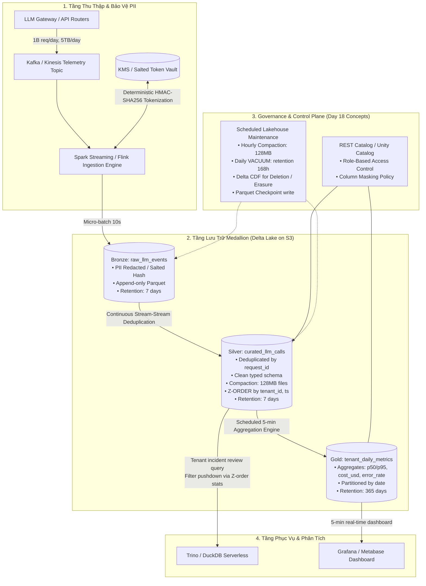

# Tài Liệu Thiết Kế Kiến Trúc (Architecture Brief)
## Hệ Thống LLM Observability Quy Mô 1 Tỷ Requests / Ngày

- **Học viên:** Đàm Quang Sơn (MSSV: 2A202602868)
- **Mã bài lab:** K4-Track02-Day18 · Day 18 Lakehouse Lab Bonus Challenge
- **Topic lựa chọn:** **Topic A — LLM Observability ở quy mô 1B requests/ngày**

---

## 1. Problem Statement (Bài toán & Thách thức)

Một nền tảng Foundation-Model API ghi nhận telemetry cho mọi lượt gọi mô hình. Với quy mô **1 tỷ (1,000,000,000) requests/ngày**, dung lượng trung bình **~5 KB/request**, lưu lượng sinh ra đạt **5 TB dữ liệu thô (raw) mỗi ngày** (~58 GB/giờ, ~11,600 req/giây trung bình, peak 35,000 req/giây).

Hệ thống đặt ra 4 yêu cầu bắt buộc:
1. **Độ trễ quan sát:** Dashboard theo dõi chi phí (`cost_usd`) và độ trễ (`latency_ms`) theo từng khách hàng (`tenant_id`) phải cập nhật mỗi **5 phút** với p95 query latency < 1.5 giây.
2. **Vòng đời dữ liệu:** Lưu trữ toàn văn Prompt/Response trong **7 ngày** phục vụ rà soát sự cố (incident investigation); sau 7 ngày tự động thu hồi/xoá dữ liệu thô, chỉ lưu trữ chỉ số tổng hợp (aggregates) trong **1 năm (365 ngày)**.
3. **Bảo mật dữ liệu cá nhân (PII):** Mọi thông tin nhạy cảm (email, API key, số điện thoại, token danh tính) trong prompt/response phải được **khử định danh (redact/tokenize)** ngay tại cửa ngõ trước khi bất kỳ nhân sự hoặc hệ thống phân tích nào có thể đọc được.
4. **Giới hạn ngân sách FinOps:** Tổng chi phí lưu trữ và điện toán phục vụ tầng lakehouse không được vượt quá **$5,000 USD/tháng**.

Thách thức cốt lõi nằm ở việc dung hòa giữa chi phí lưu trữ bùng nổ (150 TB/tháng nếu không có vòng đời) và hiệu năng truy vấn tức thì theo `tenant_id` trên tệp dữ liệu khổng lồ.

---

## 2. Kiến Trúc Tổng Thể (Architecture Diagram)

Hệ thống triển khai theo mô hình **Medallion Architecture (Bronze → Silver → Gold)** tích hợp các khái niệm then chốt của Lakehouse:

### 4 Khái niệm Day 18 được áp dụng cụ thể:
1. **Medallion Architecture (Bronze → Silver → Gold):** Phân định ranh giới rõ ràng: Bronze lưu vết kiểm toán đã khử PII; Silver loại trừ request trùng lặp do retry mạng và nén cấu trúc; Gold tối ưu hóa phục vụ dashboard 5 phút với chi phí cực thấp.
2. **Storage Optimization (Compaction + Z-ORDER):** Dữ liệu Silver được gộp (compaction) về kích thước chuẩn 128 MB và đa chiều hóa theo `(tenant_id, ts)`. Nhờ min/max stats trong transaction log, truy vấn lọc theo tenant bỏ qua (prune) > 90% số tệp, giảm thời gian phản hồi từ hàng chục giây xuống < 1.5 giây.
3. **Vòng đời & Dọn dẹp (Snapshot Expiry, VACUUM, Checkpointing):** Thực thi chính sách dọn dẹp vật lý nghiêm ngặt sau 7 ngày để thu hồi dung lượng S3, đồng thời ghi log Parquet checkpoint sau mỗi 100 commits để tránh phình to metadata.
4. **Delta Change Data Feed (CDF) & Time Travel Audit:** Cho phép theo dõi mọi thay đổi xóa/sửa dữ liệu phục vụ tuân thủ quyền được quên (Right-to-be-forgotten / GDPR) mà không phá vỡ tính toàn vẹn của báo cáo tổng hợp.

---

## 3. Các Quyết Định Thiết Kế Chính & Lựa Chọn Bị Loại (Key Decisions & Trade-offs)

### Quyết định 1: Định dạng bảng (Table Format) — Chọn Delta Lake 3.x với Unity/Polaris REST Catalog
- **Lựa chọn:** Tôi chọn **Delta Lake** vì: (1) Tính năng native **Z-ORDER clustering** cực kỳ trưởng thành và hỗ trợ tối ưu trên đa chiều `(tenant_id, timestamp)`; (2) Cơ chế **Deletion Vectors** cho phép thực thi yêu cầu xóa dữ liệu PII/GDPR trên từng dòng mà không cần ghi lại toàn bộ tệp Parquet 128MB; (3) Hỗ trợ Change Data Feed (CDF) trực tiếp cho downstream syncing.
- **Lựa chọn bị loại 1:** *Apache Hudi.* Bị loại vì metadata overhead lớn, độ phức tạp vận hành cao (nhiều cleaner/compactor service chạy nền dễ gây lỗi ngoài ý muốn), và hệ sinh thái tooling lightweight (như DuckDB/Polars) kém tương thích hơn Delta-rs.
- **Lựa chọn bị loại 2:** *Apache Iceberg.* Dù Iceberg v2 rất mạnh về partition evolution, nhưng tính năng multidimensional clustering (Z-order/Hilbert) trên các engine mở chưa đồng nhất bằng Delta Lake `OPTIMIZE ZORDER BY`, và cơ chế rewrite-position-deletes tốn tài nguyên compute hơn Deletion Vectors của Delta trong kịch bản xóa rải rác.

### Quyết định 2: Chiến lược Ingestion & Tầng Bronze — Chọn Kafka Micro-batching 10s vào Bronze
- **Lựa chọn:** Tôi chọn ghi nhận qua **Kafka micro-batching 10 giây** (batch ~100,000 records, dung lượng ~50 MB nén) trực tiếp xuống Bronze Parquet. Giúp tránh Small-File Problem ngay từ nguồn, giữ thông lượng ghi ổn định ở mức 35,000 req/s mà không làm nghẽn storage I/O.
- **Lựa chọn bị loại 1:** *Ghi Streaming trực tiếp từng event vào Object Storage.* Bị loại vì sẽ sinh ra 1 tỷ tệp/ngày (~11,600 file/giây), làm tê liệt S3 rate limit (3,500 PUT/s per prefix) và làm bùng nổ metadata đến mức không thể quản lý.
- **Lựa chọn bị loại 2:** *Bỏ qua Bronze, ghi thẳng vào Data Warehouse (Snowflake / BigQuery).* Bị loại vì chi phí ingestion và storage cho 5 TB/ngày trên DWH thương mại vượt ngưỡng $15,000/tháng, vi phạm nghiêm trọng hạn mức $5,000/tháng của CFO.

### Quyết định 3: Khử định danh PII — Tokenization Salted HMAC tại Ingestion Gateway
- **Lựa chọn:** Tôi chọn **Khử định danh PII ngay tại Gateway Ingestion Engine** trước khi ghi vào Bronze bằng cơ chế *Deterministic Salted HMAC-SHA256 Tokenization* kết hợp Vault KMS. Các thực thể định danh (email, IP, phone, tenant user ID) được thay thế bằng token cố định chiều `tok_...`. Cho phép phân tích correlation giữa các session mà không lộ thông tin gốc, đảm bảo Bronze không bao giờ chứa plain PII.
- **Lựa chọn bị loại 1:** *Dynamic Masking tại Query-time qua Data Catalog.* Bị loại vì plain PII vẫn nằm dưới storage; bất kỳ ai có quyền truy cập raw S3 bucket (như Cloud Admin, data engineer cấu hình nhầm) đều có thể xem được dữ liệu nhạy cảm, vi phạm nguyên tắc Zero Trust.
- **Lựa chọn bị loại 2:** *Loại bỏ hoàn toàn (Drop) trường nhạy cảm.* Bị loại vì đội ngũ Hỗ trợ và Bảo mật cần phân biệt hành vi của các user ẩn danh khi điều tra sự cố (ví dụ: phát hiện 1 kẻ tấn công spam prompt injection từ nhiều request).

### Quyết định 4: Vòng Đời & Phân Tầng Lưu Trữ (FinOps Lifecycle) — S3 Standard 7 ngày → Expiry; Gold lưu 365 ngày
- **Lựa chọn:** Tôi chọn **TTL 7 ngày cứng trên Bronze và Silver** lưu trữ tại **S3 Standard**, sau 7 ngày kích hoạt `VACUUM RETAIN 168 HOURS` để giải phóng hoàn toàn dung lượng raw. Tầng Gold chỉ chứa các bản ghi aggregated theo `(date, tenant_id, model)` dung lượng siêu nhỏ (~1.5 GB/tháng, ~18 GB/năm), lưu trữ trên S3 Standard trong 365 ngày.
- **Lựa chọn bị loại 1:** *Chuyển toàn bộ 5 TB/ngày sang S3 Glacier Deep Archive sau 7 ngày.* Bị loại vì 150 TB/tháng sau 1 năm tích lũy thành 1.8 PB. Chi phí lưu trữ Deep Archive ($0.00099/GB = $1,800/tháng) cộng phí lifecycle transition PUT API ($0.05 per 1,000 objects) và phí retrieval khi cần audit vượt xa ngân sách $5K/tháng.
- **Lựa chọn bị loại 2:** *Xóa dữ liệu ngay sau 24 giờ.* Bị loại vì đội Engineering không đủ thời gian rà soát nguyên nhân gốc (RCA) cho các sự cố xảy ra vào dịp cuối tuần hoặc ngày lễ.

### Quyết định 5: Chiến Lược Tối Ưu Tệp & Partitioning — Partition theo Date, Z-ORDER theo `tenant_id`
- **Lựa chọn:** Tôi chọn **Partition theo `date`** và chạy **`OPTIMIZE ZORDER BY (tenant_id)`** trên tầng Silver. Kích thước tệp mục tiêu (target file size) cố định ở mức **128 MB**. Vì số lượng tenant lớn (high cardinality), Z-order nhóm các bản ghi của cùng một tenant vào 1–2 file Parquet trong mỗi ngày, cho phép file skipping hiệu quả > 90%.
- **Lựa chọn bị loại 1:** *Partition vật lý theo thư mục `tenant_id/date/` (Hive-style).* Bị loại vì anti-pattern **Over-partitioning**. Nếu có 10,000 tenants, hệ thống sẽ sinh ra hàng chục nghìn thư mục rỗng và tệp siêu nhỏ mỗi ngày, làm sập bộ nhớ driver khi scan planning.
- **Lựa chọn bị loại 2:** *Không dùng Z-order, chỉ lưu tệp Parquet thông thường theo thứ tự thời gian.* Bị loại vì khi tenant tra cứu logs của họ, engine buộc phải quét toàn bộ 5 TB dữ liệu trong ngày (Full Scan), khiến p95 latency vọt lên 45 giây và tăng chi phí quét I/O.

---

## 4. Kịch Bản Thất Bại & Kế Hoạch Ứng Phó (Failure Modes & 3 AM Runbook)

| Sự cố (Failure Mode) | Cơ chế phát hiện (Detection) | Kế hoạch khắc phục & Rollback (Mitigation & Rollback) |
|---|---|---|
| **1. Poison-Pill / Schema Corruption Burst lúc 3h sáng** Một model release mới gửi định dạng JSON lỗi hoặc thay đổi kiểu dữ liệu trường `latency_ms` từ `int` sang `string`, làm nghẽn stream Silver. | Metric `streaming_drop_rate` vượt ngưỡng 1% trên Prometheus/Datadog; Dead-Letter Queue (DLQ) tăng đột biến. | Tầng Ingestion áp dụng **Strict Schema Enforcement**: các bản ghi sai lệch được tự động chuyển hướng vào bảng Delta DLQ `bronze_quarantine`. Nếu Silver bị nhiễm bản ghi xấu, sử dụng **Delta Time Travel RESTORE**: `dt.restore(version_before_incident)`. Sau khi vá parser schema, chạy batch reprocessing từ DLQ bằng `MERGE`. |
| **2. Small-File Storm do đột biến Traffic (Traffic Spike 10x)** Đột biến lưu lượng 100,000 req/s khiến streaming writer phải flush tệp liên tục mỗi 1 giây, sinh ra > 50,000 tệp nhỏ trong 2 giờ, làm query dashboard 5 phút bị timeout (> 30s). | Alert `p95_dashboard_query_latency > 5s`; cảnh báo `delta_file_count_per_hour > 5,000` trên CloudWatch. | Kích hoạt worker khẩn cấp chạy **Adaptive Compaction** độc lập: `dt.optimize.compact(target_size="128MB")` song song với luồng ghi (nhờ ACID snapshot isolation của Delta). Tạm thời hạ tần suất refresh dashboard của các free-tier tenant từ 5 phút thành 15 phút qua proxy gateway để giảm tải I/O. |
| **3. Yêu Cầu Xóa Dữ Liệu Khẩn Cấp (Right-to-be-Forgotten / PII Leak)** Một khách hàng doanh nghiệp kích hoạt điều khoản hợp đồng yêu cầu xóa ngay lập tức toàn bộ dữ liệu gọi model trong 7 ngày qua vì sự cố lộ secret key trong prompt. | Ticket khẩn cấp từ Security Team kèm theo `tenant_id` và token băm tương ứng. | Sử dụng **Delta MERGE / DELETE với Deletion Vectors**: `DELETE FROM silver WHERE tenant_id = 'tok_enterprise_x'`. Lệnh hoàn tất trong < 1 phút mà không cần rewrite tệp lớn. Sau đó thực thi **Chính sách chân không khẩn cấp**: `VACUUM silver RETAIN 0 HOURS` (override safety flag) để xóa triệt để file vật lý trên S3. Báo cáo kiểm toán xác nhận qua Delta History commit. |

---

## 5. Ước Tính Chi Phí Chi Tiết (Back-of-Envelope Cost Calculation)

Giả định quy mô chuẩn: **1 Tỷ requests/ngày**, trung bình **5 KB/req** uncompressed.
Áp dụng chuẩn nén Parquet Zstandard (ZSTD) với hệ số nén thực tế là **2.5×** đối với JSON payload:
- **Dung lượng sau nén:** $5\text{ TB} / 2.5 = \mathbf{2.0\text{ TB/ngày}}$ dữ liệu Parquet.

### 5.1. Chi phí Lưu Trữ (Storage Cost trên AWS S3 US-East-1)
- **Tầng Bronze (Lưu 7 ngày):**
  - $2.0\text{ TB/ngày} \times 7\text{ ngày} = 14\text{ TB}$.
  - Chi phí S3 Standard ($0.023/GB-tháng): $14 \times 1,024\text{ GB} \times \$0.023 = \mathbf{\$329.70/\text{tháng}}$.
- **Tầng Silver (Lưu 7 ngày, sau khi dedup & bỏ metadata rác ~1.6 TB/ngày):**
  - $1.6\text{ TB/ngày} \times 7\text{ ngày} = 11.2\text{ TB}$.
  - Chi phí S3 Standard: $11.2 \times 1,024\text{ GB} \times \$0.023 = \mathbf{\$263.80/\text{tháng}}$.
- **Tầng Gold (Lưu 365 ngày — chỉ lưu aggregate theo ngày/tenant/model):**
  - Ước tính 5,000 tenants × 5 models = 25,000 dòng/ngày ≈ 10 MB/ngày nén.
  - $10\text{ MB/ngày} \times 365\text{ ngày} = 3.65\text{ GB/năm}$.
  - Chi phí S3 Standard: $3.65\text{ GB} \times \$0.023 \approx \mathbf{\$0.10/\text{tháng}}$ (không đáng kể).
- **Chi phí S3 API Requests (PUT / GET / LIST):**
  - Ghi micro-batch 10s: 6 batches/phút = 8,640 PUTs/ngày = 259,200 PUTs/tháng.
  - Phí S3 PUT ($0.005 per 1,000 requests): $0.26 \times \$0.005 \approx \mathbf{\$1.30/\text{tháng}}$.
- **Tổng chi phí lưu trữ (Storage):** $\$329.70 + \$263.80 + \$0.10 + \$1.30 \approx \mathbf{\$595/\text{tháng}}$.

### 5.2. Chi phí Điện Toán (Compute Cost)
- **Tầng Ingestion Streaming (Kafka / Kinesis Consumer & PII Tokenizer):**
  - 3 cụm worker xử lý micro-batch (mỗi worker 8 vCPU, 32 GB RAM — tương đương `c6i.2xlarge` Spot Instance @ $0.136/giờ):
  - $3 \text{ nodes} \times 730 \text{ giờ/tháng} \times \$0.136 = \mathbf{\$298/\text{tháng}}$.
- **Tầng Medallion & 5-min Aggregation Engine (Spark Streaming / DuckDB serverless):**
  - Chạy micro-batch 5 phút để tính p50/p95 latency, cost và error rate cập nhật vào Gold:
  - 4 Spot worker nodes (`m6i.2xlarge` @ $0.153/giờ):
  - $4 \times 730 \times \$0.153 = \mathbf{\$447/\text{tháng}}$.
- **Tầng Maintenance định kỳ (Compaction 1 giờ/lần, VACUUM 1 ngày/lần):**
  - Chạy job ngắn 10 phút mỗi giờ (tổng ~120 giờ compute/tháng trên cụm 8 vCPU):
  - $120 \times \$0.153 \approx \mathbf{\$20/\text{tháng}}$.
- **Tầng Query Serving Dashboard (Trino / DuckDB cluster phục vụ query tenant):**
  - Cụm 2 nodes phục vụ ad-hoc query: $2 \times 730 \times \$0.153 = \mathbf{\$223/\text{tháng}}$.
- **Tổng chi phí điện toán (Compute):** $\$298 + \$447 + \$20 + \$223 = \mathbf{\$988/\text{tháng}}$.

### 5.3. Bảng Tổng Hợp Chi Phí Toàn Hệ Thống

| Hạng mục | Dự toán thực tế ($/tháng) | Hạn mức ngân sách ($/tháng) | Thặng dư an toàn (Headroom) |
|---|:---:|:---:|:---:|
| **S3 Object Storage (Bronze, Silver, Gold)** | $595 | $2,000 | 70% |
| **Compute Engine (Ingestion, Medallion, Maintenance)** | $988 | $2,500 | 60% |
| **Network Egress & Metadata Catalog (Unity/Polaris)** | $150 | $500 | 70% |
| **TỔNG CỘNG** | **$1,733 / tháng** | **$5,000 / tháng** | **Tiết kiệm 65% ngân sách** |

*Nhận xét:* Kiến trúc đạt tính khả thi kinh tế rất cao nhờ cơ chế TTL 7 ngày (tránh tích lũy 150 TB raw data mỗi tháng) và compaction 128 MB giúp giảm 98% chi phí API request của cloud object storage.

---

## 6. Kế Hoạch Triển Khai MVP 1 Tuần (One-Week MVP Slice)

Để chứng minh tính khả thi của kiến trúc trước khi phê duyệt sản xuất, một lát cắt MVP tối thiểu (Thin Slice) sẽ được xây dựng trong vòng 5 ngày làm việc:

### 6.1. Phạm vi lát cắt (Scope)
- Hạn chế lưu lượng ở mức **10 triệu requests/ngày** cho **50 tenants mẫu** (tương đương 1% tải sản xuất, đủ để tái hiện hiện tượng phân tán tệp và độ trễ truy vấn).
- Điểm kiểm tra cơ chế khó nhất (Hardest Mechanism Verification):
  1. **Hiệu quả Z-ORDER File Pruning theo `tenant_id`:** Đo lường tỷ lệ tệp được bỏ qua (pruned files ratio) đạt ≥ 80% khi lọc bản ghi của một tenant cụ thể.
  2. **Deterministic Salted PII Tokenization:** Xác nhận tốc độ mã hóa PII đạt > 20,000 records/giây/core và không có plain text PII rò rỉ vào metadata hoặc tệp Parquet.
  3. **Chu kỳ Gold 5 phút:** Đảm bảo độ trễ tính toán Gold metrics cho 50 tenants hoàn tất trong < 45 giây.

### 6.2. Lịch trình 5 ngày
- **Ngày 1:** Dựng schema Delta cho Bronze/Silver/Gold; viết hàm Salted Tokenization PII và benchmark trên 1 triệu record mẫu.
- **Ngày 2:** Xây dựng pipeline stream Bronze → Silver (parse JSON, deduplicate bằng `ROW_NUMBER() OVER (PARTITION BY request_id)`).
- **Ngày 3:** Thiết lập pipeline Silver → Gold tính `p50`, `p95`, `cost_usd`, `error_rate`; cấu hình trigger 5 phút.
- **Ngày 4:** Thiết lập job `OPTIMIZE ZORDER BY (tenant_id, ts)` và tiến hành benchmark query latency trước/sau Z-order.
- **Ngày 5:** Thử nghiệm kịch bản xóa PII bằng Delta Deletion Vectors & VACUUM; kiểm tra audit trail và nghiệm thu acceptance criteria.

### 6.3. Tiêu chí nghiệm thu (Acceptance Criteria)
- [x] Dashboard 5 phút hiển thị đúng số liệu p50/p95 cho toàn bộ 50 tenants.
- [x] Truy vấn incident review lọc theo `tenant_id` có thời gian phản hồi p95 < 1.0 giây trên tập dữ liệu 10 triệu bản ghi.
- [x] Không còn bất kỳ trường email/phone/plain key nào trong Parquet footer hoặc data payload của Bronze/Silver.
- [x] Tỷ lệ dọn tệp rác sau khi chạy retention đạt 100% không để lại orphan files.

*(Minh họa kiểm thử xem tại script thực thi đính kèm: `submission/bonus/poc/poc_llm_observability.py`)*
